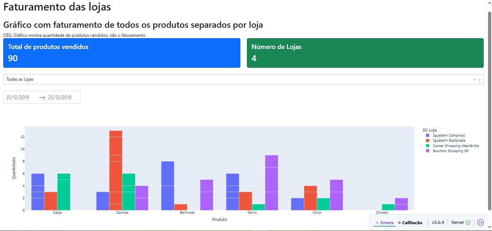
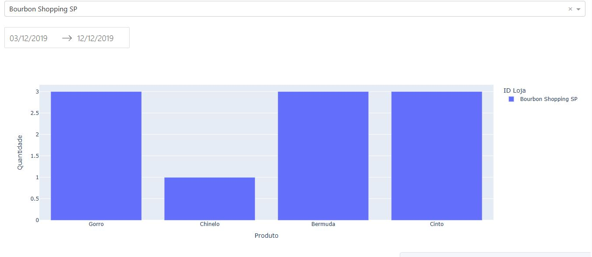

# 📊 Dashboard de Vendas

Este projeto é um dashboard interativo construído com **Dash**, **Plotly** e **Bootstrap**, que permite a visualização das vendas de produtos por loja. Os usuários podem filtrar as informações por loja e por intervalo de datas, além de exportar os dados filtrados.




---

## 🚀 Funcionalidades

- 📌 **Visualização interativa** das vendas por produto e loja
- 📌 **Filtros por Loja** (dropdown)
- 📅 **Filtro por período** (DatePicker)
- 📊 **KPIs (Indicadores)** com total de produtos vendidos e quantidade de lojas
- 💾 **Exportação dos dados filtrados em CSV**

---

## 🗂️ Estrutura do Projeto
dashboards/
├── app.py # Código principal do projeto
├── Vendas.xlsx # Base de dados (incluído no GitHub)
├── README.md # Este arquivo
├── imagens/
│   └── dash_completo.JPG
│   └── dash_filtros.JPG

---
## 📥 Instalação

1. Clone este repositório:

```bash
git clone https://github.com/gluna777/dashboards.git
cd dashboards
```

2. Coloque o arquivo Vendas.xlsx na raiz do projeto.

3. Execute o projeto:
```bash
python app.py
```

ACESSE NO NAVEGADOR, O LINK QUE APARECERÁ NO TERMINAL APÓS A EXECUÇÃO DO CÓDIGO, EXEMPLO: http://127.0.0.1:8050/

---
## 📑 Exemplo de Layout do Dashboard
**Gráfico de Barras:** Quantidade de produtos vendidos por loja

**KPIs:** Totais atualizados automaticamente pelos filtros

**Exportação CSV:** Dados filtrados pelo período e loja

---
## ⚙️ Tecnologias utilizadas
- Python

- Dash

- Plotly

- Pandas

- Dash Bootstrap Components

---
